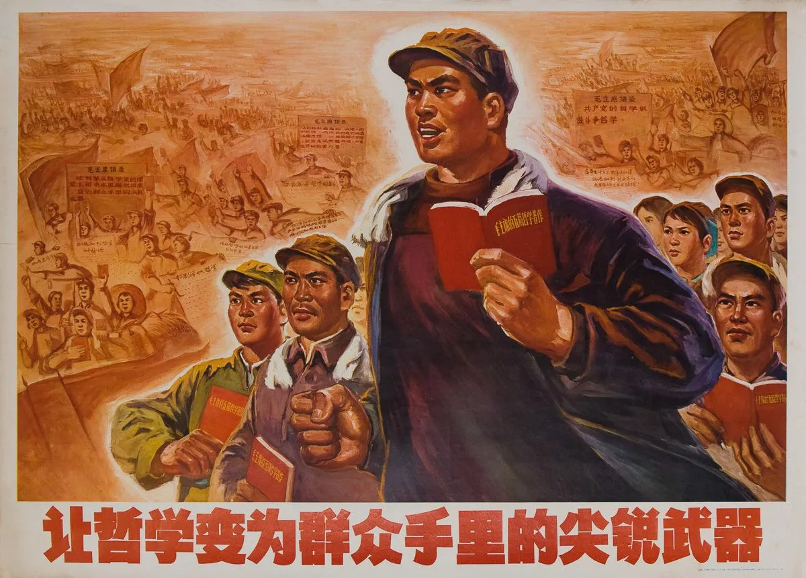

# Philosophy-Dictionary-QA-Assistant
《哲学小辞典》问答助手  

```
################### 毛主席语录 ###################

  一切共产党人和革命干部，都必须学习马克思列宁主义的
辩证唯物论，都必须学会在实际工作中运用辩证唯物论，这
是我国社会主义事业不断取得胜利的最重要的保证。

  让哲学从哲学家的课堂上和书本里解放出来，变为群众手
里的尖锐武器。

#################################################
```
 
